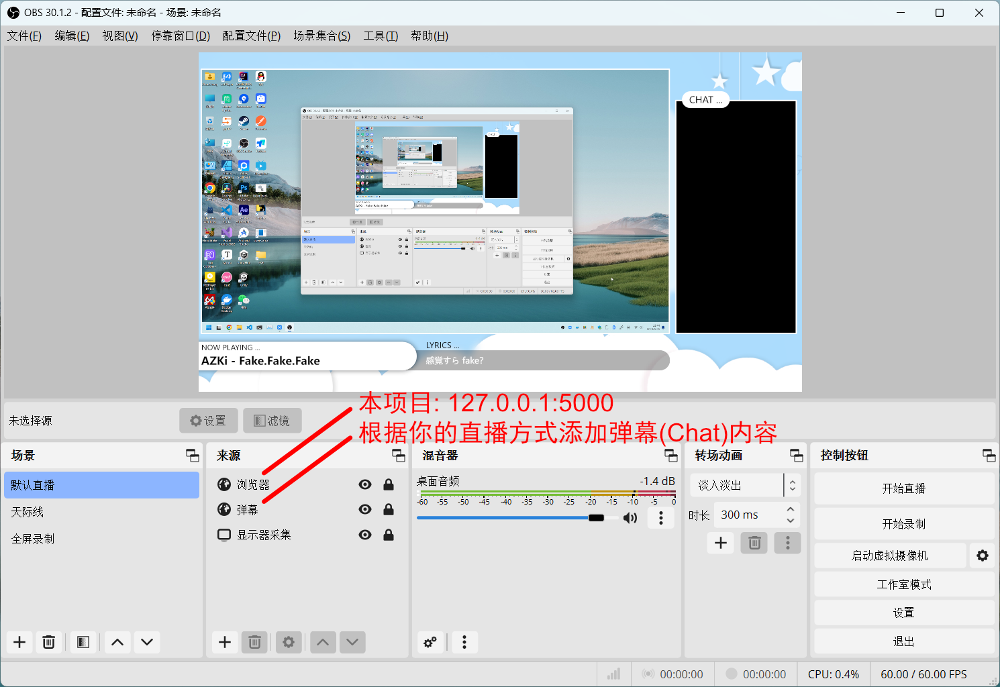

# LiveBG

Also available in English. Click [HERE](README_EN.md) to see document of English version

[netPlayer](https://github.com/Zhoucheng133/netPlayer-Next)的直播背景

> [!WARNING]
> 确保你的netPlayer版本不低于v3.1.2

## 使用方法

1. 你需要**打开netPlayer的WebSocket服务**，并且记住端口号（默认为9098）
2. 使用本程序输入WebSocket的端口号和服务的端口号（默认为5000）
3. 通过OBS将本服务作为浏览器来源

## 截图



## 自行打包

### 准备工作
- Node.js (≥ Node18)
- Go (≥1.16)
- yarn (在安装Node.js的情况下可以使用命令`npm install -g yarn`安装)

### 运行
```bash
cd web
yarn build
cd ..
go mod download
go run app.go
```

### 打包

```bash
cd web
yarn build
cd ..
go build
```

## 更新内容

### 1.1.0
- 使用Go语言重构项目
- 禁用图片拖拽

<details>
<summary>过去的版本</summary>

### 1.0.4 (2024/12/26)
- 添加手动输入服务地址的功能

### 1.0.3 (2024/12/2)
- 添加主动请求数据的功能

### 1.0.2 (2024/7/21)
- 注意 ⚠️ 这个版本开始不再兼容低于v3.1.2版本的netPlayer
- 适配新版本的netPlayer
- 可以自定义ws服务端口

### 1.0.1 (2024/6/24)
- 修复一个布局问题

### 1.0.0 (2024/6/24)
- 第一个版本

</details>