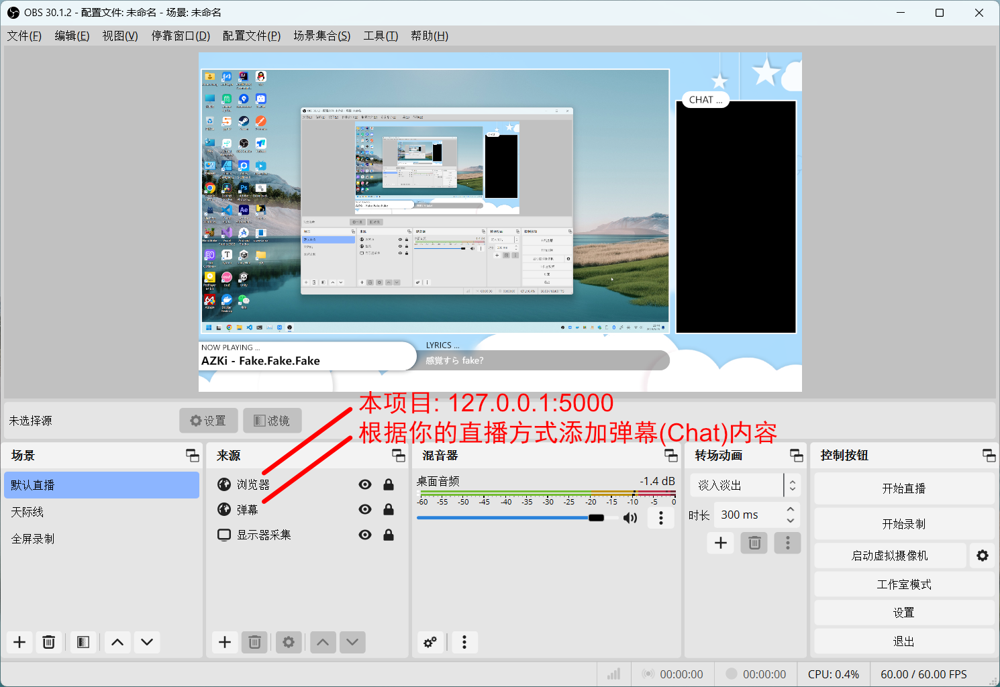

# LiveBG

Live background for [netPlayer](https://github.com/Zhoucheng133/netPlayer-Next)

> [!WARNING]
> Make sure your netPlayer version above v3.1.2

## Screenshot



## Package yourself

### Preparation
- Node.js (≥ Node18)
- Go (≥1.16)
- yarn (Use command `npm install -g yarn` to install if you installed Node.js)

### Run
```bash
cd web
yarn build
cd ..
go run app.go
```

### Build

```bash
cd web
yarn build
cd ..
go build
```


## Update log


### 1.1.0
- Redevelop with Go
- Disable dragging bg image

<details>
<summary>Previous version (NOT fully translated)</summary>

### 1.0.4 (2024/12/26)
- 添加手动输入服务地址的功能

### 1.0.3 (2024/12/2)
- 添加主动请求数据的功能

### 1.0.2 (2024/7/21)
- 注意 ⚠️ 这个版本开始不再兼容低于v3.1.2版本的netPlayer
- 适配新版本的netPlayer
- 可以自定义ws服务端口

### 1.0.1 (2024/6/24)
- 修复一个布局问题

### 1.0.0 (2024/6/24)
- 第一个版本

</details>